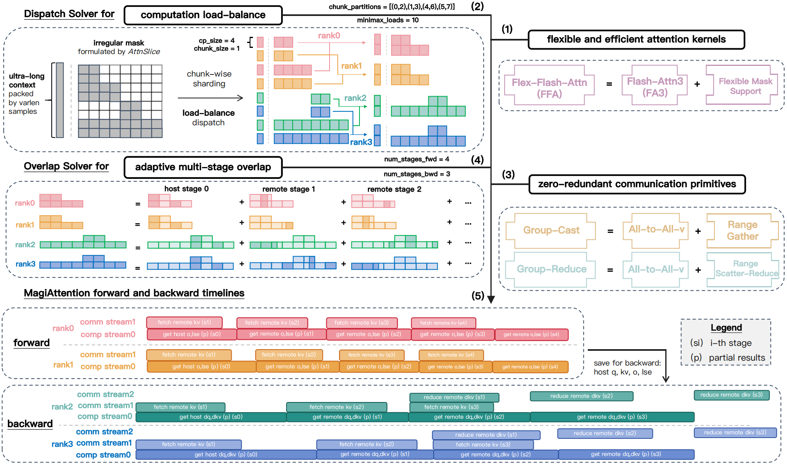
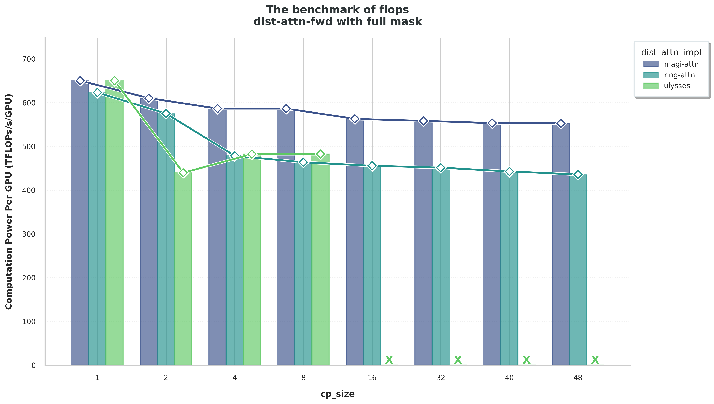
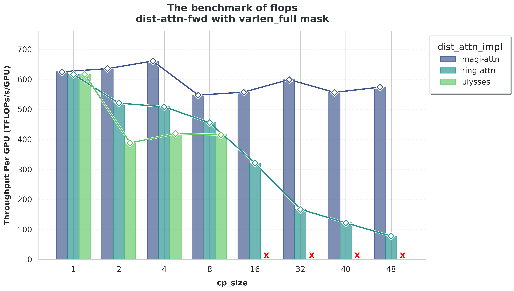
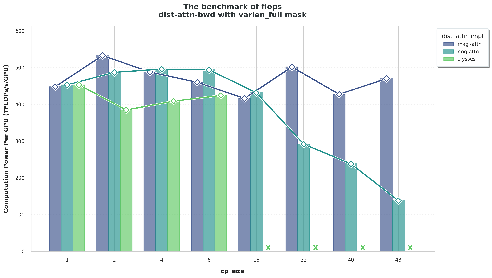

# MagiAttention

<p align="center">
    <a href="https://static.magi.world/static/files/MAGI_1.pdf"></a>
    <a href="https://SandAI-org.github.io/MagiAttention/"></a>
    <a href="https://github.com/SandAI-org/MagiAttention/releases"></a>
</p>

<p align="center">
    <a href="https://sand.ai"></a>
    <a href="https://magi.sand.ai"></a>
    <a href="https://huggingface.co/sand-ai"></a>
     <a href="https://x.com/SandAI_HQ"></a>
    <a href="https://discord.gg/hgaZ86D7Wv"></a>
    <a href="https://github.com/SandAI-org/Magi/LICENSE"></a>
</p>


<h4 align="center">
A Distributed Attention Towards Linear Scalability for Ultra-Long Context, Heterogeneous Mask Training
</h4>

<div align="center">
  
</div>


## Latest News 🔥

- [2025/5] We support overlapped q_ranges when all mask types are `FULL` (see [v1.0.1 release note](https://github.com/SandAI-org/MagiAttention/releases/tag/v1.0.1) for more details), and release the example code to **integrate Megatron with MagiAttention** with several training convergence experiments (see [here](./example/megatron/README.md) for more details).
- [2025/4] 🎉 We release [MagiAttention-v1.0.0](https://github.com/SandAI-org/MagiAttention/tree/v1.0.0) with its [blog](https://SandAI-org.github.io/MagiAttention/): a distributed attention towards linear scalability for ultra-long context, heterogeneous mask training.


# About

MagiAttention is a distributed attention mechanism, or context-parallel (CP) strategy, which aims to support a wide variety of attention mask types with **kernel-level flexibility**, while achieving **linear scalability** with respect to context-parallel (CP) size across a broad range of scenarios, particularly suitable for training tasks involving <u><em>ultra-long, heterogeneous mask</em></u> training like video-generation for [Magi-1](https://github.com/SandAI-org/MAGI-1).

Additionally, it can be easily integrated into prevalent training frameworks such as [Megatron-LM](https://github.com/NVIDIA/Megatron-LM) and Pytorch's native [FSDP](https://pytorch.org/tutorials/intermediate/FSDP_tutorial.html), as illustrated in [QuickStart](#quick-start-).

We are committed to continually improving the performance and generality of MagiAttention for the broader research community. Stay tuned for exciting enhancements and new features on the horizon!


## Key Features ✨

To realize linear scalability for distributed attention, we implement and introduce key designs as follows.

For implementation details, more experimental results and future works, please visit our [blog](https://SandAI-org.github.io/MagiAttention/#methodology).

- **Flexible Flash Attention Kernel**. We introduce a generalized formulation for irregular attention mask patterns and implement a flexible flash attention kernel (FFA). It is natively designed for distribution scenarios and provides greater flexibility in handling diverse attention mask types, with performance comparable to [Flash-Attention 3](https://arxiv.org/abs/2407.08608) on Hopper GPUs.
- **Computation Load-Balance**. With a fine-grained sharding strategy, we elaborate an efficient <em>dispatch solver</em> that ensures balanced attention computational loads across each CP rank in every training iteration.
- **Zero-Redundant Communication**. Instead of adopting the common Ring-style P2P communication pattern in CP, we propose two novel communication primitives, <em>GroupCast</em> and <em>GroupReduce</em>, built upon All-to-All-v as a prototypal implementation, enabling zero-redundant communication volume for both forward and backward passes.
- **Adaptive Multi-Stage Overlap**. Leveraging the above enhancements, we further implement a multi-stage compute-communication overlap strategy that effectively hides communication latency and adaptively optimizes overlap through manual or automatic tuning.


## Roadmap ⛏️

- [ ] Optimize `Flex-Flash-Attention` kernels to improve performance and better support sparse attention (*such as [NSA](https://arxiv.org/pdf/2502.11089)*)
- [ ] Support native `GroupCast` and `GroupReduce` kernels and hierarchical communication optimization (*similar to [DeepEP](https://github.com/deepseek-ai/DeepEP)*)
- [ ] Refactor `Distributed Attention Solver` as well as `Flex-Flash-Attention` kernel arguments to support all mask types with all kinds of overlap, and reduce CPU overhead for meta info calculation
- [ ] Improve `Dispatch Solver` to reduce necessary communication volumn while remaining balance in computation (*especially for varlen mask patterns*)
- [ ] Build a comprehensive `CP Benchmark` to better compare the performance of different context parallel strategies under various mask patterns and other training configurations


## Installation ⚙️

### Step1: Activate an NGC pytorch docker container

* release note: [here](https://docs.nvidia.com/deeplearning/frameworks/pytorch-release-notes/rel-25-02.html#rel-25-02)
* docker image version: nvcr.io/nvidia/pytorch:25.02-py3
* docker run command:

    ```bash
    docker run --name {container_name} -v {host_mnt_root}:{container_mnt_root} -it -d --privileged --gpus all --network host --ipc host --ulimit memlock=-1 --ulimit stack=67108864 nvcr.io/nvidia/pytorch:25.02-py3 /bin/bash
    ```

* docker exec command:

    ```bash
    docker exec -it {container_name} /bin/bash
    ```

### Step2: Install required packages

* command:

    ```bash
    pip install -r requirements.txt
    ```


#### Step3: Install MagiAttention from source

* command:

  ```bash
  git clone https://github.com/SandAI-org/MagiAttention.git

  cd MagiAttention

  git submodule update --init --recursive

  pip install --no-build-isolation .
  ```


## Quick Start 🚀

> [!WARNING]
> MagiAttention currently only supports Hopper GPUs.
> We intend to broaden this support in upcoming updates.


### Basic Usage

We provide an example(pseudo-code) of how to use flex_flash_attention(kernel) and magi_attention(context parallel only) to accelerate local/distribute attention calculation.

You can refer to the magi_attention/api/magi_attn_interface.py for more information.

<details>
<summary>Basic Usage</summary>

flex_flash_attention(kernel):
```python
bsz=4
seqlen=128
x = torch.randn(    # input x with shape ((bzs, seqlen), h)
            bsz * seqlen,
            h,   # hidden_size
            device=device,
            dtype=dtype,
            requires_grad = True
        )
q_ranges=AttnRanges.from_ranges(
                    [
                        [0, 128],
                        [128, 256],
                        [256, 384],
                        [384, 512],
                    ]
                ),
k_ranges=AttnRanges.from_ranges(
                    [
                        [0, 128],
                        [0, 256],
                        [0, 384],
                        [0, 512],
                    ]
                ),
max_seqlen_q=512
max_seqlen_k=512
attn_type_map=torch.tensor([0， 1， 2, 3], device=device)  # we support different mask type for different qk ranges.
'''
attn type map:
0: full attention
1: causal attention
2: inverse causal attention
3: bidirectional causal attention
for more information about attn mask type, please refer to our blog:
https://sandai-org.github.io/MagiAttention/
'''

q, k, v = q_proj(x), k_proj(x), v_proj(x)  # q with shape(s, nheads, nd), k with shape(s, nheads_kv, nd), v with shape(s, nheads_kv, nd)

# do flex_flash_attn_func forward.
out, _ = flex_flash_attn_func(
        q,
        k,
        v,
        q_ranges,
        k_ranges,
        max_seqlen_q=max_seqlen_q,
        max_seqlen_k=max_seqlen_k,
        attn_type_map=attn_type_map,
        disable_fwd_atomic_reduction=True,
    )

# generate g with same shape as out
g = torch.randn(bsz * seqlen_q, nheads, nd, device=device, dtype=dtype)
# do backward
out.backward(g)

```


flash_attn_varlen like interface(magi_attn_varlen_dispatch):
```python
from magi_attention.api import magi_attn_flex_dispatch, undispatch, calc_attn, squash_batch_dim, full_attention_to_varlen_attention, compute_pad_size   # func tools and interface

# ---  prepare data and args for magi_attention --- #

# create input data with shape (bs, seqlen, h)
x = torch.randn(
            batchsize,
            seqlen,
            h,
            device=device,
            dtype=dtype,
            requires_grad = True
        )

# squash the batch dim, magi_attention do not support input data with batch dim.
x = squash_batch_dim(x_with_batch)  # ((b, seqlen), h)

# get cu_seqlens_q,k after squashing.
cu_seqlens_q, cu_seqlens_k = full_attention_to_varlen_attention(
                                batch_size, seqlen
                             )

# pad input seqlen for better performance
pad_size, _ = compute_pad_size(x, cp_size, head_dim)

total_seqlen_q: int = batchsize * seqlen
total_seqlen_k: int = batchsize * seqlen

# ---   magi_attention dispatch   --- #

# dispatch global input tensor to each rank and get the runtime_key
local_x, magi_attn_runtime_key = magi_attn_varlen_dispatch(  # local_x with shape ((total_seq + pad_size) / cp_size), h)
        x,
        cu_seqlens_q,
        cu_seqlens_k,
        head_dim=head_dim,
        pad_size=pad_size,
        cp_group=cp_group,
        causal=False,
        dist_attn_config=DistAttnConfig(
                dispatch_config=DispatchConfig(alg=MinHeapDispatchAlg()),
                overlap_config=OverlapConfig(
                enable=True,
                mode=AttnOverlapMode.STATIC,
                degree=2,
                min_chunk_size=512,
                max_num_chunks=64,
                alg=OverlapAlgType.UNIFORM,
                ),
            ),
        )

......

# ---  magi_attention calculation and undispatch  --- #
# do q k v projection
local_q, local_k, local_v = q_project(local_x), k_project(local_x), v_project(local_x)  # q, k, v with shape (bs * seqlen / cp_size, nh, hd)

# Do local attention computation with runtime key
local_out, _ = calc_attn(local_q, local_k, local_v, magi_attn_runtime_key) # local out with shape (bs * seqlen / cp_size, h)

# Gather local attention results to global result with runtime key
total_out = undispatch(local_out, magi_attn_runtime_key)   # total out with shape (bs * seqlen, h)
```

magi_attn_flex_dispatch(more flexible):
```python

x = torch.randn(
          seqlen,
          h,
          device=device,
          dtype=dtype,
          requires_grad = True
      )
# block mask
q_ranges = AttnRanges.from_ranges(
                    [
                        [0, 128],
                        [128, 256],
                        [256, 384],
                        [384, 512],
                        [512, 640],
                        [640, 768],
                        [768, 960],
                    ]
                ),
k_ranges = AttnRanges.from_ranges(
                    [
                        [0, 128],
                        [0, 256],
                        [0, 384],
                        [0, 512],
                        [512, 640],
                        [512, 768],
                        [768, 960],
                    ]
                ),

total_seqlen_q = 960
total_seqlen_k = 960
attn_mask_type = [AttnMaskType.FULL] * 7
pad_size, _ = compute_pad_size(total_seqlen_q, cp_size, head_dim)

local_x, magi_attn_runtime_key = magi_attn_flex_dispatch( # local_x with shape (total_seqlen_q + pad_size) / cp_size, h)
                x,
                q_ranges=q_ranges,
                k_ranges=k_ranges,
                attn_mask_type=attn_mask_type,
                total_seqlen_q=total_seqlen_q,
                total_seqlen_k=total_seqlen_k,
                head_dim=head_dim,
                pad_size=pad_size,
                cp_group=self.nccl_group,
                is_same_source=True,
                is_q_permutable=True,
                is_k_permutable=True,
                dist_attn_config=dist_attn_config,
          )

......

# ---  magi_attention calculation and undispatch  --- #
# do q k v projection
local_q, local_k, local_v = q_project(local_x), k_project(local_x), v_project(local_x)  # q, k, v with shape (s, nh, hd)

# Do local attention computation with runtime key
local_out, _ = calc_attn(local_q, local_k, local_v, magi_attn_runtime_key) # local out with shape (s, h)

# Gather local attention results and unpad to global result with runtime key
total_out = undispatch(local_out, magi_attn_runtime_key)   # total out with shape (totoal_seqlen_q, h)
```

</details>


### Examples to integrate with FSDP2

We provide an example of how to integrate magi_attention with fsdp2 in `example/torch_native`. You can use `bash run.sh` to run the example.

In this example, we build a llama-1b model and apply fsdp2 with magi_attention as the parallelism strategy.

- `example/torchnative/modeling_llama.py`: build llama model and integrate with magi_attention.
- `example/torchnative/main.py`: main training loop.

</details>


### Examples to integrate with Megatron-LM

Coming soon ...


## Documentation

Coming soon ...


## Performance Benchmarks 📊


### Kernel-Level Performance and Flexibility

To demonstrate FFA kernels' state-of-the-art performance and flexibility in handling ultra-long, heterogeneous mask training, we measure the computing power (in $\texttt{TFLOPs/s}$) on Hopper GPUs for both forward and backward passes of prevalent attention kernels across standard and irregular mask patterns.

| settings              | value                                                                          |
|-----------------------|-----------------------------------------------------------------------------|
| batch size (b)        | 1                                                                            |
| number of heads (nh)  | nhq:nhk:nhv = 64:8:8 (GQA)                                    |
| head dimension (hd)   | 128                                                                           |
| dtype                 | torch.bfloat16                                                               |
| dropout probability   | 0.0                                                                          |
| window size           | 1024 (for sliding window masks only)                        |

Benchmark settings: for each mask pattern, we vary the sequence length `seqlen` from $4k,8k,16k,...,$ up to $128k$ (`seqlen_q = seqlen_k = seqlen`) while measuring computation power (in $\texttt{TFLOPs/s}$) for forward and backward passes of different attention kernels. Other configurations are fixed using common training settings (see the table above) to focus on the impact of sequence length and mask pattern. For the varlen packed data, we simply follow the variable sequence length distribution in the open-sourced dataset [ChatQA2-Long-SFT-data](https://huggingface.co/datasets/nvidia/ChatQA2-Long-SFT-data), from which we sample to pack and pad to the required `seqlen`.

Some Results are reported in the following figures, see more in our [blog](https://SandAI-org.github.io/MagiAttention/#kernel-level).


<div align="center">
  
  <div style="font-style: italic; margin-top: 5px;">Benchmarking FFA's performance and flexibility against other leading attention kernels for full mask scenarios.</div>
</div>

<div align="center">
  
  <div style="font-style: italic; margin-top: 5px;">Benchmarking FFA's performance and flexibility against other leading attention kernels for causal mask scenarios.</div>
</div>

<div align="center">
  
  <div style="font-style: italic; margin-top: 5px;">Benchmarking FFA's performance and flexibility against other leading attention kernels for varlen full mask scenarios.</div>
  <div style="font-style: italic; margin-top: 5px;">Note that: the <b>E</b> symbol indicates the corresponding distributed attention implementation raises <em>Cuda Out of Memory</em> error in that specific configuration.</div>
</div>

<div align="center">
  
  <div style="font-style: italic; margin-top: 5px;">Benchmarking FFA's performance and flexibility against other leading attention kernels for varlen causal mask scenarios.</div>
  <div style="font-style: italic; margin-top: 5px;">Note that: the <b>E</b> symbol indicates the corresponding distributed attention implementation raises <em>Cuda Out of Memory</em> error in that specific configuration.</div>
</div>

<div align="center">
  
  <div style="font-style: italic; margin-top: 5px;">Benchmarking FFA's performance and flexibility against other leading attention kernels for sliding-window causal mask scenarios.</div>
  <div style="font-style: italic; margin-top: 5px;">Note that: the <b>E</b> symbol indicates the corresponding distributed attention implementation raises <em>Cuda Out of Memory</em> error in that specific configuration.</div>
</div>

<div align="center">
  
  <div style="font-style: italic; margin-top: 5px;">Benchmarking FFA's performance and flexibility against other leading attention kernels for varlen block causal mask scenarios.</div>
  <div style="font-style: italic; margin-top: 5px;">Note that: the <b>E</b> symbol indicates the corresponding distributed attention implementation raises <em>Cuda Out of Memory</em> error in that specific configuration, while the <b>X</b> symbol indicates the corresponding distributed attention implementation is not supported in that specific configuration.</div>
</div>


### Module-Level Scalability


To validate the scalability of MagiAttention, we assess the per-GPU computing power (in $\texttt{TFLOPs/s/GPU}$) of the attention module during both forward and backward propagation, as the sequence length and parallel size increase. This assessment is compared against common CP strategies including [Ring-Attention](https://arxiv.org/abs/2310.01889) and [Ulysses](https://arxiv.org/abs/2309.14509). Due to the complexity of supporting irregular masks for baselines, our experiments are limited to the full mask and varlen full mask scenarios. And the distribution of variable sequence lengths still follow the one in [Kernel-Level Experiments](#kernel-level-performance-and-flexibility).

The experiments are conducted on a large-scale productive GPU cluster (<em>Due to business and confidentiality reasons, specific details about the productive cluster, such as the number and type of GPUs, are withheld.</em>). We scale the total sequence length `seqlen`, the context-parallel size `cp_size`, and the node size `nnodes` together from `seqlen:64k, cp_size:1, nnodes:1`, `seqlen:128k, cp_size:2, nnodes:2`, ..., to `seqlen:3072k (3M), cp_size:48, nnodes:48`.

The tensor-parallel size `tp_size` is fixed at 8, with sequence-parallel enabled. Other data and model configurations for different mask types are the same as in the table in [Kernel-Level Experiments](#kernel-level-performance-and-flexibility).

Therefore, in every training setting, each rank is assigned constantly with `seqlen=64k`, `num_heads_q = 8` and `num_heads_k = 1` for attention propagation, while the remaining activations stays `seqlen=8k`, `num_heads_q = 64` and `num_heads_k = 8` with SP enabled. This setup simulates a common training configuration.

Some of the results are presented in the following figures, see more in our [blog](https://SandAI-org.github.io/MagiAttention/#module-level).

As demonstrated, MagiAttention exhibits linear scalability as the context length and CP size increase, in both full mask and varlen full mask configurations, for both forward and backward passes. In contrast, baseline methods either face strict limitations in scaling up or experience performance degradation with ultra-long contexts, which worsens with varlen mask patterns.


<div align="center">
  
  
  <div style="font-style: italic; margin-top: 5px;">Benchmarking MaiAttention's scalability against other leading CP strategies for full mask scenarios.</div>
  <div style="font-style: italic; margin-top: 5px;">Note that: the <b>X</b> symbol indicates the corresponding distributed attention implementation is not supported in that specific configuration.</div>
</div>

<div align="center">
  
  
  <div style="font-style: italic; margin-top: 5px;">Benchmarking MaiAttention's scalability against other leading CP strategies for varlen full mask scenarios.</div>
  <div style="font-style: italic; margin-top: 5px;">Note that: the <b>X</b> symbol indicates the corresponding distributed attention implementation is not supported in that specific configuration.</div>
</div>


## Contributing 🤝

We welcome and value any contributions and collaborations. Please check out [CONTRIBUTING.md](./CONTRIBUTING.md) for how to get involved.


## License ⚖️

This project is licensed under the Apache License 2.0 - see the [LICENSE](LICENSE) file for details.


## Citation 📝

If you use MagiAttention in your research, please cite:

```bibtex
@misc{magiattention2025,
  title={MagiAttention: A Distributed Attention Towards Linear Scalability for Ultra-Long Context, Heterogeneous Mask Training},
  author={Zewei, Tao and Yunpeng, Huang},
  year={2025},
  howpublished={\url{https://github.com/SandAI-org/MagiAttention/}},
}
```

## Acknowledgement

We are grateful to the contributors listed below for their valuable contributions during the early stages of MagiAttention.

| Member   | Affiliations         | Email                        | GitHub Account    |
|:-----------|:-------------|:----------------------------|:---------------|
| Zewei Tao    | SandAI       | zeweitao@sand.ai            | littsk         |
| Yunpeng Huang    | SandAI, Nanjing University       | yunpenghuang@sand.ai,hyp@smail.nju.edu.cn       | Strivin0311    |
| Qiangang Wang    | Nanjing University | 522024330081@smail.nju.edu.cn | WT1W           |
| Hanwen Sun   | SandAI, Peking University |  sunhanwen@stu.pku.edu.cn |  hanwen-sun  |
| Tao Bu      | Nanjing University | 502024330002@smail.nju.edu.cn | Big-TRex       |
| WenYang Fang    | Nanjing University | fwy@smail.nju.edu.cn        | kagami4243     |
| Siyuang Yan    | Nanjing University | siyuanyan@smail.nju.edu.cn  | FibonaccciYan  |
| Zixu Jiang     | Nanjing University | 522023330040@smail.nju.edu.cn | 191220042      |
| Dingkun Xu    | Nanjing University | 211220090@smail.nju.edu.cn  | PureDimension  |
| Mingyu Liang    | Nanjing University |   mingyuliang518@gmail.com     | gaomusiki      |
| Jingwei Xu    | Nanjing University | jingweix@nju.edu.cn | paragonlight   |


## Star History

<div align="center">
  <a href="https://star-history.com/#SandAI-org/MagiAttention&Date">
    
  </a>
</div>
