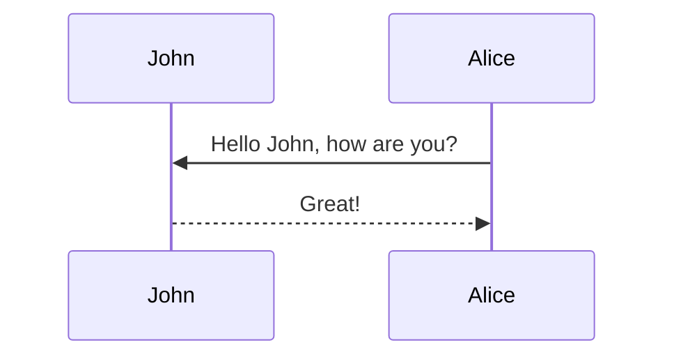

## Overview

<!-- <div class="l-body"> -->
<div class="l-middle">
<!-- <div class="l-page"> -->
  <div class="row mt-3">
      <div class="col-sm mt-3 mt-md-0">
          
      </div>
  </div>
  <div class="caption">
    Overview of MagiAttention: (1) FFA, an efficient kernel based on Flash-Attention 3, supports flexible mask patterns; (2) The dispatch solver shards and dispatches packed data with ultra-long contexts and heterogeneous masks, ensuring load-balanced computation; (3) Group-Cast and Group-Reduce primitives eliminate redundant communication; (4) The overlap solver adaptively partitions communication for optimal overlap; (5) During runtime, MagiAttention propagates with flexible and efficient kernels, zero-redundant communication, and multi-stage overlap scheduling, achieving linear scalability.
  </div>
</div>


## Abstract

Training large-scale models for video generation presents two major challenges: (1) The extremely long context length of video tokens, which reaching up to 4 million during training, results in prohibitive computational and memory overhead. (2) The combination of block-causal attention and Packing-and-Padding (PnP) introduces highly complex attention mask patterns. 

To address these challenges, we propose [MagiAttention](https://github.com/SandAI-org/MagiAttention), which aims to support a wide variety of attention mask types with **kernel-level flexibility**, while achieving **linear scalability** with respect to context-parallel (CP) size across a broad range of scenarios, particularly suitable for training tasks involving <u><em>ultra-long, heterogeneous data</em></u> training like video-generation for [Magi-1](https://github.com/SandAI-org/Magi-1).


## Introduction

Training large-scale autoregressive diffusion models like \magi for video generation presents two major challenges: 

- The extremely long context length of video tokens, which reaching up to 4 million during training, results in prohibitive computational and memory overhead. Context-Parallelism (CP) is designed for dealing such long context challenge, but existing state-of-the-art CP methods<d-cite key="jacobs2023deepspeed,liu2023ringattentionblockwisetransformers,fang2024uspunifiedsequenceparallelism,gu2024loongtrainefficienttraininglongsequence,chen2024longvilascalinglongcontextvisual"></d-cite> face scalability limitations that face scalability limitations due to size constraints or the high communication overhead inherent in inefficient ring-style point-to-point (P2P) patterns. While recent efforts<d-cite key="wang2024datacentricheterogeneityadaptivesequenceparallelism,zhang2024dcp,ge2025bytescaleefficientscalingllm"></d-cite> dynamically adjust CP sizes to avoid unnecessary sharding and redundant communication for shorter sequences, they still incur extra memory overhead for NCCL buffers and involve complex scheduling to balance loads and synchronize across different subsets of ranks.

- The combination of block-causal attention and Packing-and-Padding (PnP) introduces highly complex attention mask patterns with variable sequence lengths, which cannot be efficiently handled by existing attention implementations.


To address the aforementioned challenges, we propose MagiAttention, which aims to support a wide variety of attention mask types (\emph{i.e.} kernel flexibility) while achieving linear scalability with respect to context-parallel (CP) size across a broad range of scenarios. Achieving this goal depends on meeting the following fundamental conditions:

- <em>Linearly Scalable Attention Kernel</em>: The performance of the attention kernel should not degradate as CP size increases. To this end, we introduce [Flex-Flash-Attention](#flex-flash-attn), an extension of FlashAttention-3 (FA3), which native considers the efficiency impact of attention mask partitioning in distributed environments. It supports distributable mask representations with a tailored kernel implementation to ensure scalability while accommodating a broader range of attention mask types.
- <em>Balanced Computational Workloads</em>: Imbalances in the computational load across CP ranks lead to unavoidable idle bubbles that hinder scalability. MagiAttention is natively designed to ensure [Computation Load Balancing](#comp-load-balance), mitigating such inefficiencies.
- <em>Full Overlap of Communication and Computation</em>: Without sufficient overlap, increasing CP size results in communication-induced idle time on GPUs, impairing scalability. MagiAttention introduces novel [Zero-Redundant Communication Primitives](#zero-redundant-comm) to minimize communication overhead, along with an [Adaptive Multi-Stage Overlap](#multi-stage-overlap) strategy that enables effective communication-computation overlap.

The overview of MagiAttention is shown in [Overview](#overview), and we will introduce key designs in the following [Methodology](#methodology) section, with comprehensive experimental results presented in [Experiment](#experiment).


## Related Work

To tackle the ultra-long context challenge in large-scale model training, the distributed attention mechanism, or context parallelism (CP), is essential. 

However, current strategies fall short in our demanding settings. DeepSpeed’s Ulysses<d-cite key="jacobs2023deepspeed"></d-cite> leverages the multi-head characteristic for head-sharded, sequence-complete propagation in the attention module, and head-complete, sequence-sharded propagation elsewhere, with transformation between parallel placements efficiently handled by All-to-All collective communication. While easy to integrate, it has scalability limitations, requiring the number of heads to be divisible by the CP size, particularly in GQA settings or with tensor parallelism<d-cite key="shoeybi2020megatronlm,korthikanti2022reducing"></d-cite>. In contrast, Ring-Attention<d-cite key="li2021sequence,liu2023ringattentionblockwisetransformers,wang2024tokenringefficientparallelismframework"></d-cite> keeps sequence-sharded activations and accesses the complete sequence through multi-stage ring-style point-to-point (P2P) communication to perform online attention propagation<d-cite key="rabe2021self,dao2022flashattention"></d-cite> and pipeline compute-communication overlap<d-cite key="wang2022overlap"></d-cite>. Though more scalable, it suffers from significant communication overhead due to large communication volumes and inefficient P2P send/receive primitives over the entire CP group as the CP size increases. Some following works<d-cite key="fang2024uspunifiedsequenceparallelism,gu2024loongtrainefficienttraininglongsequence,chen2024longvilascalinglongcontextvisual"></d-cite> combine Ulysses and Ring-Attention in a 2D distributed attention approach to mitigate their limitations, yet still lack the efficiency and scalability required for our ultra-long context settings.

Worse still, for irregular attention mask patterns like the aforementioned varlen masks, classic Ring-Attention-based CP strategies are facing more challenges, besides the attention kernel limitations. First, the naive <em>sequential even sharding</em> along the sequence dimension causes uneven distribution of the varlen mask area, leading to imbalanced computational loads across CP ranks. Although the customized <em>zigzag sharding</em> design<d-cite key="ring_flash_attention_issue2"></d-cite> balances loads for specific (varlen) causal mask patterns in the following figure, it results in kernel performance degradation from fragmented sharding and excessive padding, and does not generalize well to other patterns including the <em>varlen block-causal mask</em> met in autoregressive video generation.


<div class="l-middle">
  <div class="row mt-3">
      <div class="col-sm mt-3 mt-md-0">
          
      </div>
  </div>
  <div class="caption">
    Illustration of Ring-Attention’s customized sharding strategies for load balancing. (a) Full mask uses sequential sharding for the global mask; (b) Causal mask employs tailored <em>zigzag sharding</em><d-cite key="ring_flash_attention_issue2"></d-cite>; (c) Varlen full mask applies sequential sharding per local mask (one per packed sample); (d) Varlen causal mask uses <em>zigzag sharding</em> per local mask, causing performance degradation from fragmentation and padding.
  </div>
</div>

Second, the communication overhead issue is exacerbated under sparse varlen mask settings, as entire sequence chunks are still transferred across all CP ranks even when not all ranks require them, might causing over 30% redundant communication costs as illustrated in the following figure. Third, the former challenges cause the pipeline compute-communication overlap strategy fails more often due to imbalanced loads and large communication overheads, further limiting scalability.

<div class="l-middle">
  <div class="row mt-3">
      <div class="col-sm mt-3 mt-md-0">
          
      </div>
  </div>
  <div class="caption">
    Examples illustrating redundant communication in Ring P2P patterns for distributed attention given heterogeneous masks.: (a) Even with a simple causal mask, Ring P2P incurs <b>25%</b> redundant communication; (b) For irregular mask patterns such as varlen block-causal mask with last global block, Ring P2P results in over <b>33%</b> redundancy.
  </div>
</div>

Recent efforts<d-cite key="wang2024datacentricheterogeneityadaptivesequenceparallelism,zhang2024dcp,ge2025bytescaleefficientscalingllm"></d-cite> attempt to address these issues by dynamically assigning communication groups of specific CP sizes to different samples based on their sequence lengths, to reduce unnecessary sharding and redundant communication for shorter sequences. However, these methods suffer from extra memory overhead for NCCL buffers and complex scheduling for computation load-balance and synchronization across different sets of ranks.


## Methodology

### Flex-Flash-Attn

### Comp Load-Balance

### Zero-Redundant Comm

### Multi-Stage Overlap

$$
E=mc^2
$$

Method Method Method Method Method Method Method Method Method $$E=mc^2$$ Method

## Experiment





Regular text





> A quote





Hipster list

- brunch
- fixie
- raybans
- messenger bag





| Left aligned | Center aligned | Right aligned |
| :----------- | :------------: | ------------: |
| Left 1       |    center 1    |       right 1 |
| Left 2       |    center 2    |       right 2 |
| Left 3       |    center 3    |       right 3 |

<p></p>

Experiment Experiment Experiment Experiment Experiment Experiment Experiment Experiment

## Discussion

```c++
int main(int argc, char const *argv[])
{
    string myString;

    cout << "input a string: ";
    getline(cin, myString);
    int length = myString.length();

    char charArray = new char * [length];

    charArray = myString;
    for(int i = 0; i < length; ++i){
        cout << charArray[i] << " ";
    }

    return 0;
}
```

Discussion Discussion Discussion Discussion Discussion Discussion Discussion Discussion

## Reference

Citations are then used in the article body with the `<d-cite>` tag.
The key attribute is a reference to the id provided in the bibliography.
The key attribute can take multiple ids, separated by commas.

The citation is presented inline like this: <d-cite key="jacobs2023deepspeed"></d-cite> (a number that displays more information on hover).
If you have an appendix, a bibliography is automatically created and populated in it.

Distill chose a numerical inline citation style to improve readability of citation dense articles and because many of the benefits of longer citations are obviated by displaying more information on hover.
However, we consider it good style to mention author last names if you discuss something at length and it fits into the flow well — the authors are human and it’s nice for them to have the community associate them with their work.

Just wrap the text you would like to show up in a footnote in a `<d-footnote>` tag.
The number of the footnote will be automatically generated.<d-footnote>This will become a hoverable footnote.</d-footnote>

## Appendix

Appendix Appendix Appendix Appendix Appendix Appendix Appendix Appendix Appendix Appendix

### mermaid



### jupyter notebook

{::nomarkdown}






<p>Sorry, the notebook you are looking for does not exist.</p>

{:/nomarkdown}

### chartjs

```chartjs
{
  "type": "line",
  "data": {
    "labels": [
      "January",
      "February",
      "March",
      "April",
      "May",
      "June",
      "July"
    ],
    "datasets": [
      {
        "label": "# of bugs",
        "fill": false,
        "lineTension": 0.1,
        "backgroundColor": "rgba(75,192,192,0.4)",
        "borderColor": "rgba(75,192,192,1)",
        "borderCapStyle": "butt",
        "borderDash": [],
        "borderDashOffset": 0,
        "borderJoinStyle": "miter",
        "pointBorderColor": "rgba(75,192,192,1)",
        "pointBackgroundColor": "#fff",
        "pointBorderWidth": 1,
        "pointHoverRadius": 5,
        "pointHoverBackgroundColor": "rgba(75,192,192,1)",
        "pointHoverBorderColor": "rgba(220,220,220,1)",
        "pointHoverBorderWidth": 2,
        "pointRadius": 1,
        "pointHitRadius": 10,
        "data": [
          65,
          59,
          80,
          81,
          56,
          55,
          40
        ],
        "spanGaps": false
      }
    ]
  },
  "options": {}
}
```

### echarts

```echarts
{
  "title": {
    "text": "ECharts Getting Started Example"
  },
  "responsive": true,
  "tooltip": {},
  "legend": {
    "top": "30px",
    "data": ["sales"]
  },
  "xAxis": {
    "data": ["Shirts", "Cardigans", "Chiffons", "Pants", "Heels", "Socks"]
  },
  "yAxis": {},
  "series": [
    {
      "name": "sales",
      "type": "bar",
      "data": [5, 20, 36, 10, 10, 20]
    }
  ]
}
```

### geojson

```geojson
{
  "type": "FeatureCollection",
  "features": [
    {
      "type": "Feature",
      "properties": {},
      "geometry": {
        "coordinates": [
          [
            [
              -60.11363029935569,
              -2.904625022183211
            ],
            [
              -60.11363029935569,
              -3.162613728707967
            ],
            [
              -59.820894493858034,
              -3.162613728707967
            ],
            [
              -59.820894493858034,
              -2.904625022183211
            ],
            [
              -60.11363029935569,
              -2.904625022183211
            ]
          ]
        ],
        "type": "Polygon"
      }
    }
  ]
}
```

### code diff

```diff
diff --git a/sample.js b/sample.js
index 0000001..0ddf2ba
--- a/sample.js
+++ b/sample.js
@@ -1 +1 @@
-console.log("Hello World!")
+console.log("Hello from Diff2Html!")
```

### vega lite

```vega_lite
{
  "$schema": "https://vega.github.io/schema/vega-lite/v5.json",
  "description": "A dot plot showing each movie in the database, and the difference from the average movie rating. The display is sorted by year to visualize everything in sequential order. The graph is for all Movies before 2019.",
  "data": {
    "url": "https://raw.githubusercontent.com/vega/vega/main/docs/data/movies.json"
  },
  "transform": [
    {"filter": "datum['IMDB Rating'] != null"},
    {"filter": {"timeUnit": "year", "field": "Release Date", "range": [null, 2019]}},
    {
      "joinaggregate": [{
        "op": "mean",
        "field": "IMDB Rating",
        "as": "AverageRating"
      }]
    },
    {
      "calculate": "datum['IMDB Rating'] - datum.AverageRating",
      "as": "RatingDelta"
    }
  ],
  "mark": "point",
  "encoding": {
    "x": {
      "field": "Release Date",
      "type": "temporal"
    },
    "y": {
      "field": "RatingDelta",
      "type": "quantitative",
      "title": "Rating Delta"
    },
    "color": {
      "field": "RatingDelta",
      "type": "quantitative",
      "scale": {"domainMid": 0},
      "title": "Rating Delta"
    }
  }
}
```

### typograms

```typograms
.------------------------.
|.----------------------.|
||"https://example.com" ||
|'----------------------'|
| ______________________ |
||                      ||
||   Welcome!           ||
||                      ||
||                      ||
||  .----------------.  ||
||  | username       |  ||
||  '----------------'  ||
||  .----------------.  ||
||  |"*******"       |  ||
||  '----------------'  ||
||                      ||
||  .----------------.  ||
||  |   "Sign-up"    |  ||
||  '----------------'  ||
||                      ||
|+----------------------+|
.------------------------.
```
