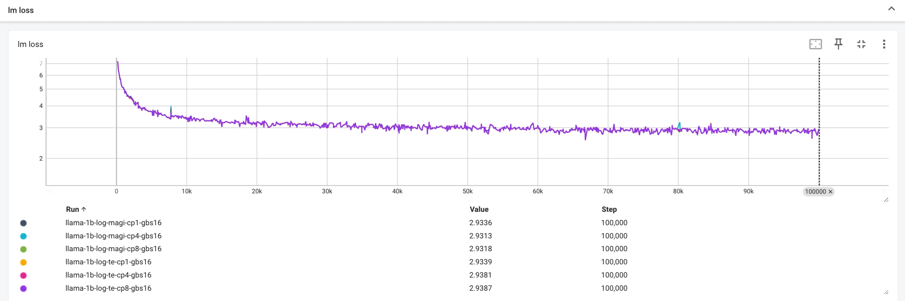

# Integrating Megatron with MagiAttention

We create a new repository [Megatron-LM-MagiAttention](https://github.com/SandAI-org/Megatron-LM-MagiAttention/tree/magi_attention), forked from [Megatron-LM v0.11.0](https://github.com/NVIDIA/Megatron-LM/tree/v0.11.0), to provide an example of training the LLaMA-3B model with Megatron-LM + MagiAttention.

For more details on data preparation, checkpoint setup, integration, and experiments, please refer to [README](https://github.com/SandAI-org/Megatron-LM-MagiAttention/blob/magi_attention/magiattention_example/README.md), and this [PR](https://github.com/SandAI-org/Megatron-LM-MagiAttention/pull/1) for code modification.

## Convergence Experiments

We compared the loss convergence curves of TE Ring Attention and MagiAttention by training the LLaMA-1B model from scratch.

### Training Environment
| **Env**                 | **version**                                                                                |
| ----------------------------- | -------------------------------------------------------------------------------------------- |
|  docker             |  ngc25.02-py3  |
|  MagiAttention      |  commit-id: 4a10ea3
|  Megatron           |  Tags: core_v0.11.0

### Training Settings

| **Configuration**                 | **Value**                                                                                |
| ----------------------------- | -------------------------------------------------------------------------------------------- |
| **Dataset**                   | [OpenWebText](https://huggingface.co/datasets/Skylion007/openwebtext)                        |
| **Model Size**                | LLaMA-1B                                                                                     |
| **Number of Layers**          | 16                                                                                           |
| **Hidden Size**               | 2048                                                                                         |
| **Number of Attention Heads** | 32                                                                                           |
| **Group Query Attention**     | Enabled                                                                                      |
| **Number of Query Groups**    | 8                                                                                            |
| **Sequence Length**           | 8192                                                                                         |
| **Context Parallel Size**     | CP1/2/4/8 (MagiAttention vs. TE Ring Attention) with a global batch size of 16               |
| **Training Iterations**       | 100,000                                                                                      |

### Results

MagiAttention aligns well with TE Ring Attention.

Feel free to open an issue in the [Megatron-LM-MagiAttention](https://github.com/SandAI-org/Megatron-LM-MagiAttention) repository if you have any questions.
